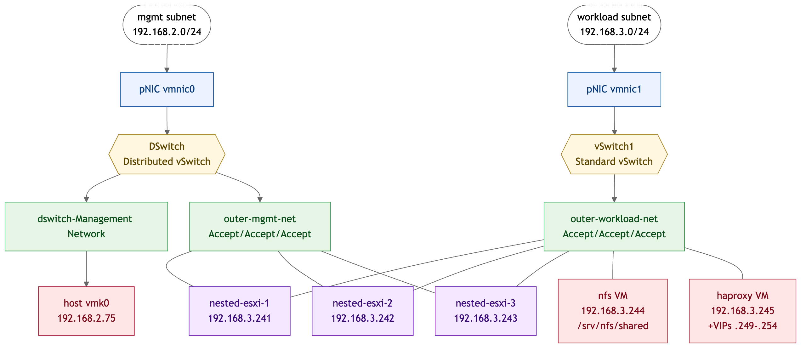
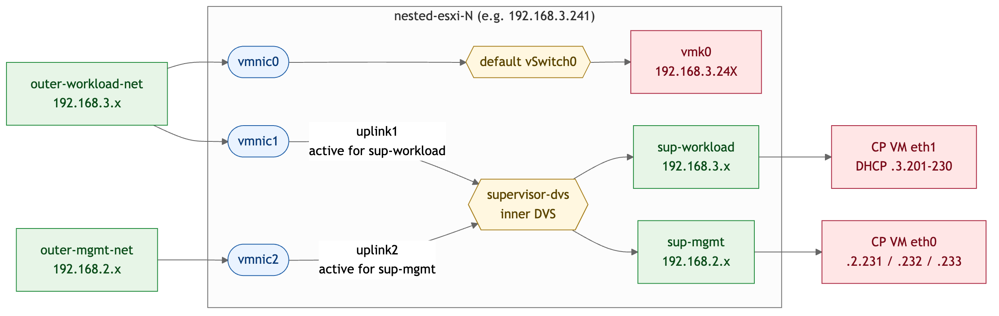

# Supervisor Cluster — Vanilla vCenter Prerequisites

Everything Terraform expects to already exist before `make apply` from the
`terraform/` directory. The Terraform module set automates the Supervisor
deployment itself; this document covers the manual infrastructure that
sits underneath it.

---

## 0. Hardware

- 1 physical server with ESXi installed
- ≥ 128 GB RAM (3 nested ESXi × 24 GB + HAProxy 2 GB + NFS 4 GB + vCSA 16 GB + headroom)
- ≥ 250 GB free on local datastore
- Two physical NICs minimum:
  - One on the management subnet (e.g. `192.168.2.0/24`)
  - One on the workload subnet (e.g. `192.168.3.0/24`)

---

## Network topology you're building toward

Two physical subnets feed everything: `192.168.2.0/24` for management,
`192.168.3.0/24` for workload. Each physical NIC (pNIC) on the host is
the door into one of those subnets. From there, virtual switches and
virtual NICs (VMXNET3 throughout) shape the rest of the topology.

### Outer view — what runs on the *physical* ESXi host

{ width=100% }

### Inside each nested ESXi VM — `supervisor-dvs`

Terraform's `network` module creates a Distributed vSwitch *inside* the
nested ESXi cluster and claims two of the three vNICs as uplinks. The
third (`vmnic0`) stays on the nested ESXi's default `vSwitch0` to carry
the host's own management (`vmk0`).

{ width=100% }

When the Supervisor's 3 Control Plane VMs come up on these nested
hosts, each one has two vNICs: one on `sup-mgmt` (gets
`192.168.2.231/232/233`), one on `sup-workload` (gets a `.3.201-230`
DHCP-style address). Their `sup-mgmt` frames egress via `vmnic2` →
outer `outer-mgmt-net` → physical `vmnic1` → physical 192.168.2 fabric.
`sup-workload` frames egress via `vmnic1` → outer `outer-workload-net`
→ physical `vmnic1` → physical 192.168.3 fabric.

### IP allocation summary

| Where | Adapter | NIC type | Network | IP |
| --- | --- | --- | --- | --- |
| Physical host | `vmnic0` | **pNIC** | mgmt subnet | (uplink, no IP) |
| Physical host | `vmnic1` | **pNIC** | workload subnet | (uplink, no IP) |
| Physical host | `vmk0` | VMkernel | `dswitch-Management Network` | `192.168.2.75` |
| nested-esxi-1 | vNIC1 → `vmnic0` | **VMXNET3** | `outer-workload-net` | (`vmk0` rides here) |
| nested-esxi-1 | vNIC2 → `vmnic1` | **VMXNET3** | `outer-workload-net` | (uplink, no IP) |
| nested-esxi-1 | vNIC3 → `vmnic2` | **VMXNET3** | `outer-mgmt-net` | (uplink, no IP) |
| nested-esxi-1 | `vmk0` | VMkernel | inside `vmnic0` | `192.168.3.241` |
| nested-esxi-2 | (same shape) |   |   | `vmk0 = 192.168.3.242` |
| nested-esxi-3 | (same shape) |   |   | `vmk0 = 192.168.3.243` |
| nfs VM | eth0 | VMXNET3 | `outer-workload-net` | `192.168.3.244` |
| haproxy VM | eth0 | VMXNET3 | `outer-workload-net` | `192.168.3.245` + VIPs `.249–.254` |
| Supervisor CP VM 1 | eth0 → sup-mgmt | VMXNET3 | `sup-mgmt` (inner) | `192.168.2.231` |
| Supervisor CP VM 1 | eth1 → sup-workload | VMXNET3 | `sup-workload` (inner) | DHCP from `.3.201–230` |
| Supervisor CP VM 2 | (same shape) |   |   | `sup-mgmt = 192.168.2.232` |
| Supervisor CP VM 3 | (same shape) |   |   | `sup-mgmt = 192.168.2.233` |

---

## 1. vCenter & Clusters

In vCenter:

1. **Datacenter** — confirm one exists, named `Datacenter` (or update
   `var.datacenter` in `terraform/examples/lab/main.tf` to match yours).
2. **Physical cluster** — create a cluster named `Cluster`. Add the
   physical ESXi host (`192.168.2.75`) to it. DRS/HA off is fine here.
3. **Supervisor cluster** — create a separate empty cluster named
   `Supervisor-Cluster`. Leave it empty for now; you'll add the nested
   ESXi hosts to it in step 6.
   - **Enable DRS** (required for Workload Management)
   - **Enable HA** (Supervisor enable flips this on anyway, but
     pre-enabling avoids reconfigure during apply)

---

## 2. Outer networking on the physical host

You need **two switches** on the physical host: a Distributed vSwitch
(`DSwitch`) for the management plane, and a Standard vSwitch (`vSwitch1`)
for the workload plane.

### 2a. The Distributed vSwitch (`DSwitch`) — management plane

If your vCenter already created a default DSwitch, use it. Otherwise
create one named `DSwitch` with the physical host attached and one uplink
on the management pNIC (e.g. `vmnic0` → `192.168.2.0/24`).

Required port groups on `DSwitch`:

| Port group | Purpose |
| --- | --- |
| `dswitch-Management Network` | vCSA + physical host `vmk0` (192.168.2.x) |
| `dswitch-vmotion` | vMotion (auto-created with most installs) |
| `dswitch-VM Network-ephemeral` | vCSA's "VM Network"-style ephemeral PG |
| **`outer-mgmt-net`** | **Bridge port group for nested ESXi `vmnic2` → 192.168.2.x management** |

Create `outer-mgmt-net` if not present:

> Networking → DSwitch → New Distributed Port Group

Complete property list (defaults are fine for any field not shown):

| Property | Value |
| --- | --- |
| Name | `outer-mgmt-net` |
| Port binding | **Static** (default) |
| Port allocation | **Elastic** (default — grows on demand) |
| Number of ports | `8` (default; auto-expands) |
| Network resource pool | (default) |
| VLAN type | None |
| VLAN ID | `0` (the 192.168.2.x subnet is untagged on the physical fabric) |
| MTU | `1500` (inherits from DSwitch) |
| Teaming and failover — Load balancing | Route based on originating virtual port (default) |
| Teaming and failover — Failback | Yes (default) |
| Teaming and failover — Active uplinks | At least one uplink active (default) |
| **Security — Promiscuous mode** | **Accept** ⚠️ override the default |
| **Security — MAC address changes** | **Accept** ⚠️ override the default |
| **Security — Forged transmits** | **Accept** ⚠️ override the default |
| Traffic shaping | Disabled (default) |
| Monitoring (NetFlow) | Disabled (default) |
| Miscellaneous (Block all ports) | No (default) |

Terraform's `host-config` module also sets the three security flags
defensively on `apply`, but doing it now means `make hard-check` passes
cleanly the first time.

> **What each teaming option actually does**
>
> The teaming defaults are correct for this lab, but worth understanding
> because they show up again on `vSwitch1` (§2b) and inside
> `supervisor-dvs` (managed by Terraform, see the inset below).
>
> - **Load balancing algorithm** — how outgoing frames pick an uplink
>   when more than one is available.
>   - *Route based on originating virtual port* (the default) pins each
>     vNIC to one uplink based on its switch-port ID. Simple, needs
>     zero physical-switch configuration, fine for most cases.
>   - *Route based on IP hash* is the only option that actually
>     load-balances a single flow across uplinks, but it requires the
>     physical switch to be configured for LACP/EtherChannel. Don't use
>     unless you've explicitly set that up.
>   - *Source MAC hash* and *Explicit failover order* are situational —
>     ignore for this lab.
>   - With **one uplink** (the case on `DSwitch` here and on `vSwitch1`
>     in §2b), the algorithm choice is moot — there's nothing to balance
>     across.
>
> - **Network failover detection** — how vSphere notices an uplink is
>   dead.
>   - *Link status only* (default) uses the pNIC's link state. Catches
>     "cable unplugged" and dead-NIC failures.
>   - *Beacon probing* sends periodic test frames between uplinks to
>     catch upstream-switch failures that don't drop link state.
>     Requires **≥ 3 uplinks** to disambiguate which side is broken.
>     Not applicable for single-uplink setups.
>
> - **Notify switches** — on a failover, broadcast RARP frames so
>   upstream physical switches update their MAC-address tables and
>   immediately forward traffic to the new uplink. Almost always **Yes**.
>
> - **Failback** — when a previously-failed uplink comes back, move
>   traffic back to it automatically. Defaults to **Yes**. Set to **No**
>   only if you've designated a "backup" uplink and want manual control
>   over when it takes over.
>
> - **Active / Standby / Unused uplinks** — explicit per-uplink role.
>   Default is all uplinks Active. The lab's outer switches have one
>   pNIC each (so just that one is Active). The *inner* supervisor-dvs
>   uses this to pin port groups to specific uplinks — see below.

> **Inner `supervisor-dvs` teaming (Terraform-managed — context only)**
>
> Once `make apply` creates `supervisor-dvs` inside the nested ESXi
> cluster, that DVS has **two uplinks** (`vmnic1`, `vmnic2`), and
> Terraform pins each port group to one of them so traffic egresses out
> the correct outer port group:
>
> | Inner port group | Active uplink | Egresses via | Lands on |
> | --- | --- | --- | --- |
> | `sup-workload` | uplink1 = `vmnic1` | outer `outer-workload-net` | 192.168.3.0/24 |
> | `sup-mgmt`     | uplink2 = `vmnic2` | outer `outer-mgmt-net`     | 192.168.2.0/24 |
>
> This pinning is **required**. Without it, the kernel inside each
> Supervisor Control Plane VM (which has one vNIC on each port group)
> ends up with frames egressing whichever uplink the load-balancer
> picks — which can dump `sup-workload` frames onto the 192.168.2
> fabric and vice versa. That's the same class of dual-NIC routing
> ambiguity that bit us in the original Phase 9 incident, just one
> layer down.
>
> You don't have to configure this manually — the `network` module
> handles it — but the underlying setting is the same "Active /
> Standby / Unused uplinks" knob described above, applied per port
> group.

> **Why all three must be Accept for nested ESXi**
>
> A nested ESXi host forwards frames *on behalf of* the VMs running
> inside it (and, once `supervisor-dvs` is created, on behalf of the
> Supervisor Control Plane VMs that ride its inner port groups). Those
> frames look "wrong" from the outer vSwitch's point of view:
>
> - **Forged transmits = Accept** — outgoing frames from a nested ESXi
>   vNIC carry source MACs that aren't the vNIC's own (they're the
>   inner VM's). vSphere drops such frames by default; this lets them
>   pass.
> - **MAC address changes = Accept** — same idea for cases where the
>   inner stack changes the MAC after the vNIC is up (uncommon but the
>   nested-virt teaming path can trip it).
> - **Promiscuous mode = Accept** — incoming frames to inner VM MACs
>   aren't addressed to the nested-ESXi vNIC's own MAC; without
>   promiscuous, the outer vSwitch silently drops them on arrival.
>
> All three default to **Reject** on a vanilla vSphere install. With
> the defaults, nested ESXi seems to boot fine but inner VMs (and the
> Supervisor's CP VMs) end up with one-way or completely broken
> networking — which is hard to diagnose unless you know to look here.

### 2b. A standard vSwitch (`vSwitch1`) — workload plane

In the physical host: Networking → Virtual Switches → Add Standard vSwitch

**Standard vSwitch (`vSwitch1`) properties:**

| Property | Value |
| --- | --- |
| Name | `vSwitch1` |
| MTU | `1500` (default) |
| Number of ports | `120` (default) |
| **Uplink (physical adapter)** | a workload pNIC (e.g. `vmnic1`) on the 192.168.3.0/24 subnet |
| **Security — Promiscuous mode** | **Accept** ⚠️ override the default |
| **Security — MAC address changes** | **Accept** ⚠️ override the default |
| **Security — Forged transmits** | **Accept** ⚠️ override the default |
| Traffic shaping | Disabled (default) |
| Teaming — Load balancing | Route based on originating port ID (default) |
| Teaming — Network failover detection | Link status only (default) |
| Teaming — Notify switches | Yes (default) |
| Teaming — Failback | Yes (default) |

Then add a port group on this switch:

**Port group `outer-workload-net` properties:**

| Property | Value |
| --- | --- |
| Label / name | `outer-workload-net` |
| VLAN ID | `0` (untagged on the physical fabric) |
| Security overrides | None — inherits the three Accepts from the vSwitch above |

> Standard port groups inherit security / traffic-shaping / teaming
> from the parent vSwitch by default. Because we set Accept × 3 at the
> vSwitch level, the port group inherits them — no per-port-group
> overrides needed.

This carries the nested ESXi VMs' workload-facing vNICs (`vmnic0` and
`vmnic1` inside each nested host).

> **Note on naming:** vSphere creates a default port group named `VM
> Network` on every new standard vSwitch. For a fresh deploy, rename
> the default to `outer-workload-net` (or delete it and create a new
> one) so it matches the `outer-<role>-net` convention used for
> `outer-mgmt-net`. If you keep the default `VM Network` name (the
> Skynet lab currently does — that's why the Terraform variable
> `outer_vm_network_portgroup` defaults to `"VM Network"`), just set
> the variable to whatever you actually use.

---

## 3. Datastores

- `datastore1` (local VMFS on the physical host) — must have ≥ 200 GB free.
  The nested ESXi VMDKs + HAProxy + NFS VMs all land here.
- Other datastores (e.g. `vsanDatastore`) are fine; Terraform doesn't touch
  them.

---

## 4. Create the 3 nested ESXi VMs

For each VM (`nested-esxi-1`, `nested-esxi-2`, `nested-esxi-3`):

| Setting | Value |
| --- | --- |
| Location | Cluster `Cluster` (the physical one) |
| Datastore | `datastore1` |
| Compatibility | ESXi 8.0+ |
| Guest OS family | VMware ESX |
| Guest OS version | VMware ESXi 9.0 (or your installer version) |
| CPU | 8 vCPUs |
| **CPU → Hardware Virtualization** | ✓ **Expose hardware-assisted virtualization to the guest OS** |
| Memory | 24 – 32 GB |
| Disk 1 (boot) | 16 GB, thin provisioned |
| Disk 2 (VMFS) | 100 GB+, thin provisioned |
| Network adapter 1 | `outer-workload-net` (vSwitch1), VMXNET3 |
| Network adapter 2 | `outer-workload-net` (vSwitch1), VMXNET3 |
| Network adapter 3 | `outer-mgmt-net` (DSwitch), VMXNET3 |
| CD/DVD | ESXi installer ISO mounted, "Connect at power on" |
| Boot Options → Firmware | EFI |

---

## 5. Install ESXi on each nested VM

Power on, walk through the ESXi installer. After install:

- **Set static management IP via DCUI**:
  - `nested-esxi-1` → `192.168.3.241` / `255.255.255.0` / gateway `192.168.3.1`
  - `nested-esxi-2` → `192.168.3.242`
  - `nested-esxi-3` → `192.168.3.243`
- `vmk0` should land on adapter 1 (`vmnic0` in the nested ESXi, mapped to
  `outer-workload-net` on the physical host).
- Set DNS to `192.168.3.1, 8.8.8.8`.
- **Enable SSH and ESXi Shell** (Troubleshooting Options in DCUI) — optional
  but useful for debugging.
- Set the root password.
- Disconnect / remove the installer ISO after first boot.

---

## 6. Add nested hosts to `Supervisor-Cluster`

In vCenter: Hosts and Clusters → `Supervisor-Cluster` → Add Hosts

- Add all three: `192.168.3.241`, `192.168.3.242`, `192.168.3.243`
- Accept thumbprints
- Assign an appropriate license (vSphere with Tanzu evaluation works)

After joining, hosts may show HA warnings about heartbeat datastores —
ignore them for now. Terraform silences these after apply with
`das.ignoreInsufficientHbDatastore=true`.

---

## 7. NTP on the physical host

The Supervisor is finicky about clock skew. Verify NTP on the physical
host:

> Hosts and Clusters → Cluster → 192.168.2.75 → Configure → Time Configuration

Set NTP server to `time.cloudflare.com` (or `pool.ntp.org`), and **start
the NTP service + set to start with the host**. The nested ESXi hosts'
clocks get fixed automatically by Terraform's `host-config` module.

---

## 8. Preflight check before `terraform apply`

From `/Users/ben/Repos/greylog/terraform`:

```sh
. ../scripts/sv-env       # exports GOVC_URL / GOVC_USERNAME / GOVC_PASSWORD
make hard-check
```

Should print:

- ✓ vCenter reachable
- ✓ physical host 192.168.2.75
- ✓ Supervisor-Cluster exists
- ✓ nested host 192.168.3.241 joined
- ✓ nested host 192.168.3.242 joined
- ✓ nested host 192.168.3.243 joined

If any check fails with ✗, fix it before running `make apply`.

---

## 9. Secrets

Create `terraform/examples/lab/secrets.auto.tfvars` with:

```hcl
vcenter_password = "..."
haproxy_password = "..."
```

`chmod 600` it. It is `.gitignore`-d.

---

## 10. Optional: edit `terraform/wcp-config-Skynet.json`

This is the source of truth for the Supervisor enable spec. Defaults are
correct for the lab; if you change IPs or sizing, edit there and re-run:

```sh
cd terraform
make sync-config
```

…which regenerates `examples/lab/config.auto.tfvars` and
`haproxy-dpapi.crt` from the JSON.

---

## What Terraform creates on top of all this

Boundary between manual setup (sections above) and Terraform-managed
(below):

| Layer | Owner |
| --- | --- |
| Physical host + vCenter + DSwitch + vSwitch1 + nested-esxi-* VMs + Supervisor-Cluster | **You** (this document) |
| `outer-mgmt-net` security flags + nested host NTP | Terraform (`host-config`) |
| `supervisor-dvs` + `sup-mgmt` + `sup-workload` + uplink teaming | Terraform (`network`) |
| `nfs-storage` VM + `nfs-shared` datastore mounted on nested hosts | Terraform (`nfs`) |
| `haproxy` VM + Dataplane API + VIPs | Terraform (`haproxy`) |
| `supervisor` tag/category + storage policy + Supervisor enable | Terraform (`supervisor`) |

Once you've completed all 10 steps and `make hard-check` is clean,
deploy with:

```sh
cd /Users/ben/Repos/greylog/terraform
make apply
```
